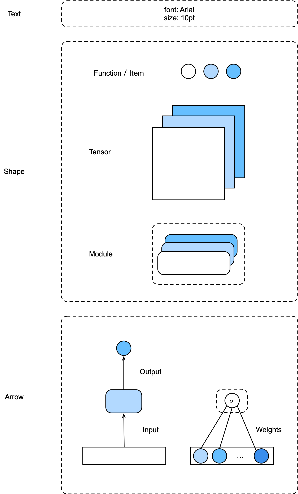

# neural network visualization

## Text

Font: arial

Size: 10pt

## Shape

| Type              | Meaning            |
| ----------------- | ------------------ |
| Circle            | Function or scalar |
| Rectangle         | Tensor             |
| Rounded rectangle | Module             |

note: The coner radius of rounded rectangle is 8pt. The both the width and height of cricles are 20pt.

## Arrow

| Type  | Meaning         |
| ----- | --------------- |
| Stick | Input or output |
| None  | Weights         |
| ...   | ...             |

note: The coner radius of arrow is 8pt. The percentage of head arrow size is 61.8%(golden ratio).