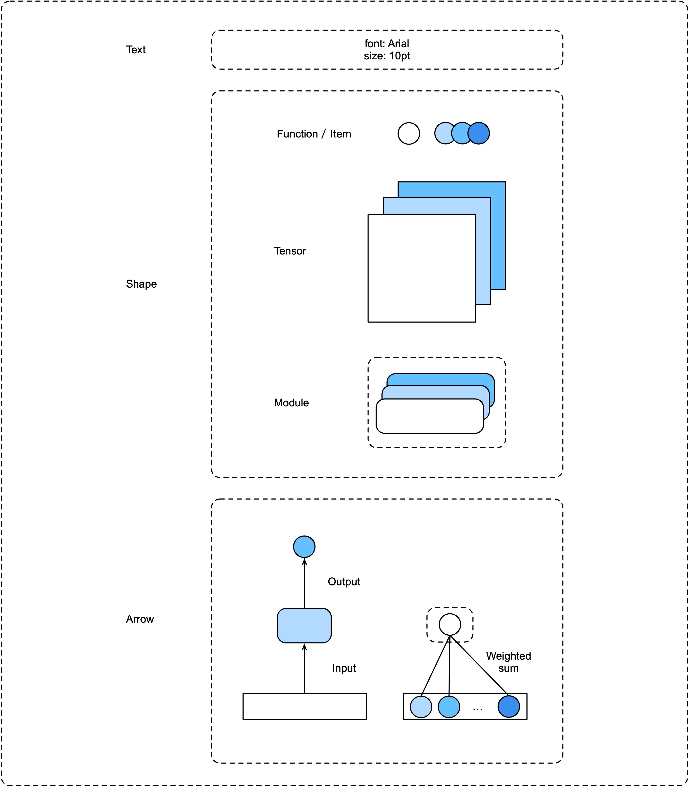

# neural network visualization

## Text

Font: arial

Size: 10pt

## Shape

| Type              | Meaning            |
| ----------------- | ------------------ |
| Circle            | Function or scalar |
| Rectangle         | Tensor             |
| Rounded rectangle | Module             |

## Arrow

| Type  | Meaning         |
| ----- | --------------- |
| Stick | Input or output |
| None  | Weights         |
| ...   | ...             |